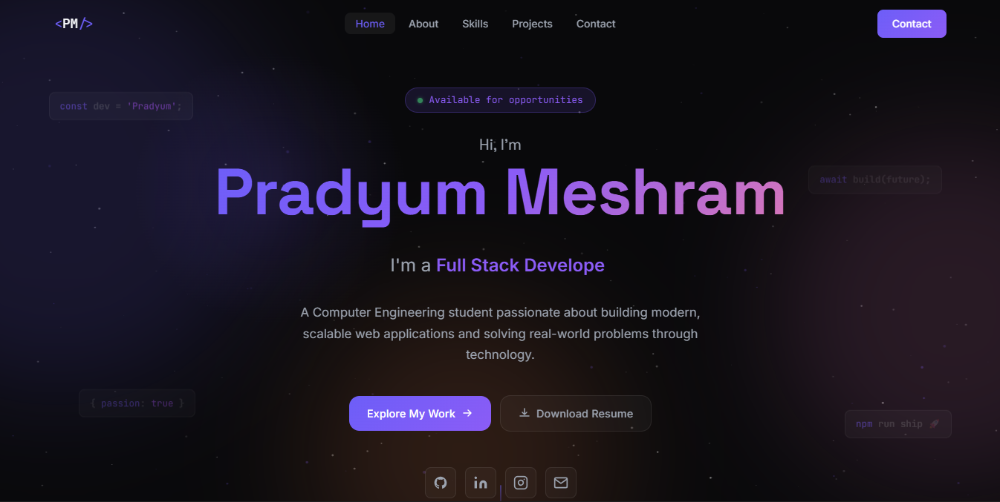

<div align="center">


# 💼 Personal Portfolio

### Modern • Responsive • Frontend Portfolio Website

Showcasing my projects, skills, and journey as a Computer Engineering student passionate about web development.

<p>

<a href="https://pradyum-02.github.io/Portfolio-Pradyum/">


</a>

</p>

</div>

---

# 👨‍💻 About

This portfolio is designed to showcase my projects, technical skills, and development journey. It features a modern UI with smooth animations, responsive layouts, and an intuitive user experience.

---

# ✨ Features

- 🎨 Modern UI
- 🌙 Dark Theme
- 📱 Fully Responsive
- ⚡ Smooth Animations
- 💼 Project Showcase
- 🛠 Skills Section
- 📞 Contact Section
- 🚀 Optimized Performance

---

# 🛠 Tech Stack

<div align="center">


</div>

---

## 📸 Preview

<p align="center">
  
</p>

---

# 📂 Folder Structure

```text
Portfolio
│
├── images
├── index.html
├── style.css
├── script.js
└── README.md
```

---

# 🚀 Getting Started

```bash
git clone <repository-url>

cd Portfolio

Open index.html
```

---

# 🎯 Future Improvements

- 🌗 Light Mode
- 📄 Resume Download
- 📈 More Projects
- 🎬 Better Animations
- 📬 Backend Contact Form

---

# 👨‍💻 Author

**Pradyum Meshram**

Crafted with Love & A lot of Coffee.

---

<div align="center">

⭐ If you like this project, consider giving it a star!

</div>

<div align="center">


</div>
